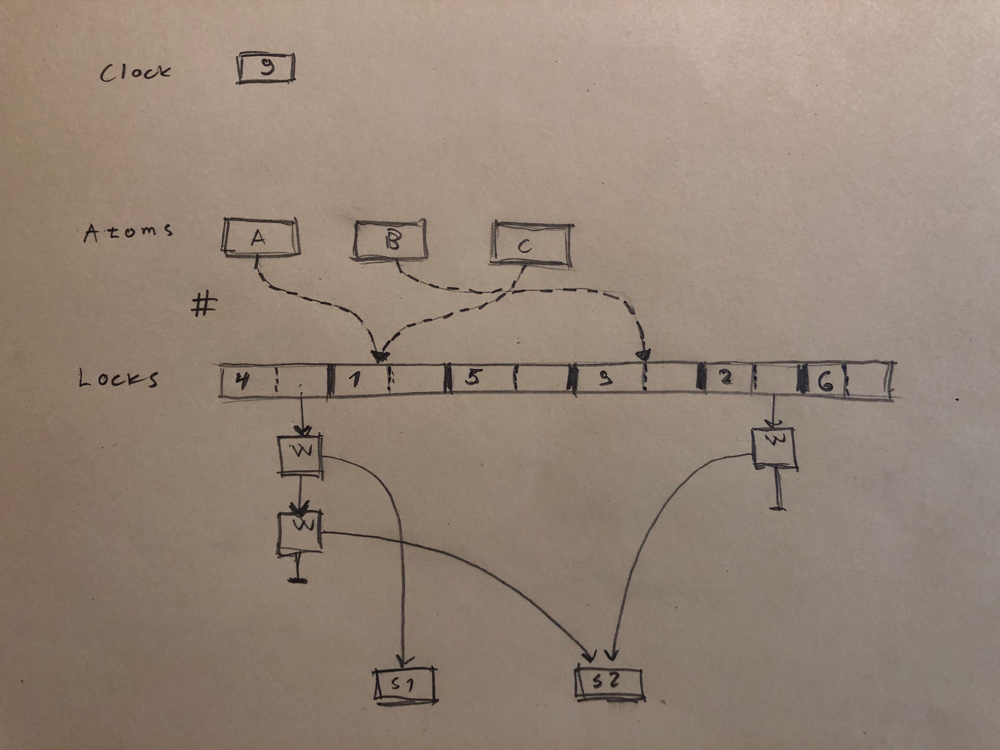

# Transactional locking for C++

Vesa Karvonen

---

## Transactional locking?

An algorithm for _Software Transactional Memory_

<!-- .element: class="fragment" -->

<dl class="fragment">
<dt><a href="https://perso.telecom-paristech.fr/kuznetso/INF346/papers/tl2.pdf">Transactional Locking II</a></dt>
<dd>Dave Dice, Ori Shalev, and Nir Shavit (2006)</dd>
</dl>

Been working on a variation of it as a _hobby project_.

<!-- .element: class="fragment" -->

---

## Demo

[Trade.C++ library](https://github.com/per-framework/trade.cpp)

---

## Background

---

### Transactional memory

- Shared-memory concurrency

- An alternative to fine-grained locking

  - ["lock-based programs do not compose"](https://www.microsoft.com/en-us/research/wp-content/uploads/2005/01/2005-ppopp-composable.pdf)
  - As if `atomically` would take a global lock
  - Cost model more like fine-grained locking
  - Challenge: TM comparable to FGL

- Software and
  [Hardware](http://www.informit.com/articles/article.aspx?p=2142912)

- [Haskell (Serializable) and Clojure (MVCC)](https://mattias.niklewski.com/2014/04/stm.html)

- Non-blocking or blocking

---

### Non-blocking algorithms

- A method is _wait-free_ if it guarantees that every call finishes its
  execution in a finite number of steps.

- A method is _lock-free_ if it guarantees that infinitely often some method
  call finishes in a finite number of steps.

---

### Why?

<small><blockquote> [...] the reason to use the lock-free and wait-free
conditions as a basis for a computability theory is not because they are
non-blocking. Rather, it is because they are _independent_ progress conditions
that do not rely on the good behavior of the operating system scheduler [...]

</blockquote></small>

[On the Nature of Progress](http://www.cs.tau.ac.il/~shanir/progress.pdf)

<!-- .element: class="fragment" -->

[Software Transactional Memory Should Not Be Obstruction-Free](https://pdfs.semanticscholar.org/3971/9c97d068c9bca7adc737b8df764ab8da0fdf.pdf)

<!-- .element: class="fragment" -->

---

### Atomic instructions

- Ops

  - Atomic loads and stores
  - Read-Modify-Write
    - Compare-and-Swap (CAS, no
      [MCAS](https://www.cl.cam.ac.uk/research/srg/netos/papers/2002-casn.pdf))
    - Load-link and store-conditional (LL/SC)
  - Barriers

- [C++ `<atomic>`](https://en.cppreference.com/w/cpp/atomic/atomic)

  - Memory orderings (Sequential consistency, Acquire-Release, Relaxed)

- Difficult to program with (e.g.
  [ABA-problem](https://en.wikipedia.org/wiki/ABA_problem))

---

### Cache coherence

- Make sure cores see a consistent view of memory

- MSI, MESI, MESIF (Intel), MOESI (AMD)

  - Modified, Shared, Invalid, Exclusive, Forward, Owned

- Exclusive vs Shared

- Bottom line:
  - Private read-write is fine
  - Shared read-only is fine
  - Shared read-write kills performance

---

## Trade.C++ and TL2

---

<small>
<blockquote>[...] TL2 improves on state-of-the-art STMs in the following
ways: (1) unlike all other STMs it fits seamlessly with any system's memory
life-cycle, including those using malloc/free (2) unlike all other lock-based
STMs it efficiently avoids periods of unsafe execution, that is, using its novel
version-clock validation, user code is guaranteed to operate only on consistent
memory states, and (3) in a sequence of high performance benchmarks, while
providing these new properties, it delivered overall performance comparable to
(and in many cases better than) that of all former STM algorithms, both
lock-based and non-blocking. [...]</blockquote>

<blockquote class="fragment"><a href="https://bartoszmilewski.com/2010/09/11/beyond-locks-software-transactional-memory/">There is one particular implementation of STM that’s been most widely
accepted: Transactional Locking II (TL2)</a>
</blockquote>
</small>

---

### TL2

- Global clock
- Every variable associated with a lock holding a version number

[An Implementation of Composable Memory Transactions in Haskell](https://www.researchgate.net/publication/220888858_An_Implementation_of_Composable_Memory_Transactions_in_Haskell)

---

---

#### Transaction

- [Sample clock](https://github.com/per-framework/trade.cpp/blob/v1/provides/include/trade_v1/private/transaction-methods.hpp#L45):
  `rv`
- [On writes](https://github.com/per-framework/trade.cpp/blob/v1/provides/include/trade_v1/private/private-methods.hpp#L92-L106):
  add to or update
  [value in write set](https://github.com/per-framework/trade.cpp/blob/v1/provides/library/trade.cpp#L160-L300)
- [On reads](https://github.com/per-framework/trade.cpp/blob/v1/provides/include/trade_v1/private/private-methods.hpp#L46-L56):
  - try write set
  - verify version not greater than `rv`
  - add to read set
- On commit:
  - [lock all variables written](https://github.com/per-framework/trade.cpp/blob/v1/provides/library/trade.cpp#L363-L364)
  - [increment clock](https://github.com/per-framework/trade.cpp/blob/v1/provides/library/trade.cpp#L385):
    `wv`
  - [revalidate reads](https://github.com/per-framework/trade.cpp/blob/v1/provides/library/trade.cpp#L392-L406)
  - [update written variable values and unlock with `wv`](https://github.com/per-framework/trade.cpp/blob/v1/provides/library/trade.cpp#L411-L412)

---

### Results

- IMBO surprisingly nice API

- Does not seem dog slow!

  - Seriously need more benchmarks

- Global clock really does limit scalability
  - 600M/150M -> 30M ops/s on a particular machine

---

### Future

- Optimizations

  - `retry` can definitely be optimized
  - Avoiding unnecessary destroy logic

- General improvements

  - More flexible allocation
  - Clock wrap-around
  - Diagnostics

- Different transaction execution modes
  - Weaker consistency (e.g. skip read validation)
  - Live lock avoidance?

---

## TM - The holy grail?

- IMHO main advantage of TM is simplicity from user POV

  - Not without gotchas

- Expressiveness

  - [Cannot have both a visible effect and `retry`](https://www.oreilly.com/library/view/parallel-and-concurrent/9781449335939/ch10.html#sec_stm-whynot)
  - No rendezvous or synchronous message passing
  - [Reagents: Expressing and Composing Fine-grained Concurrency](http://aturon.github.io/academic/reagents.pdf)
  - [Transactional Events](http://citeseerx.ist.psu.edu/viewdoc/download?doi=10.1.1.88.8589&rep=rep1&type=pdf)

---

## Questions?
