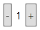
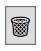
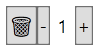
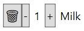
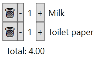
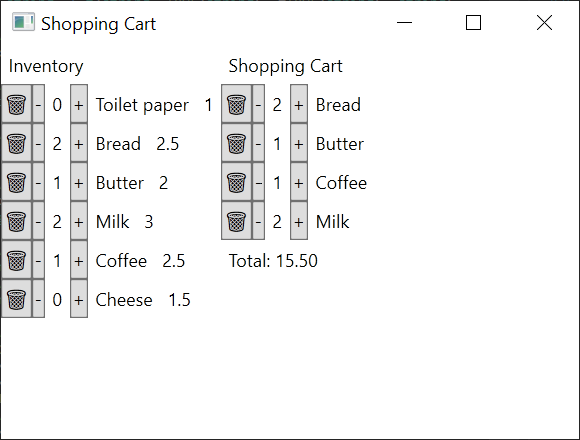

This is in continuation to

- [Referentially transparent GUIs](2020-05-11-referentially-transparent-guis.md).

---

# Counters are not toys!

Let's take a look at a simple concrete example: _the beginnings_ of a shopping
cart application. The full source code for this example implemented on top of
[WPF](https://en.wikipedia.org/wiki/Windows_Presentation_Foundation) can be
found
[here](https://github.com/polytypic/NetOptics/blob/cbd6e98cf65f8eeacd569fad033d0ed13523c265/App.ShoppingCart.fs)
and is based on an earlier example on top of [React](https://reactjs.org/) that
can be found [here](https://github.com/calmm-js/kefir.atom#tutorial).

So, how does one create a Shopping Cart UI?

### Warming up

In this example we don't care about the visual styling of our components. So,
for convenience, let's first define a little helper for creating a stack of
elements:

```fsharp
let stackElems orientation (children: IROL<_>) =
  UI.elem StackPanel [
    UI.orientation orientation
    UI.children children
  ]
```

The `stackElems` component, written with our
[`UI`](https://github.com/polytypic/NetOptics/blob/cbd6e98cf65f8eeacd569fad033d0ed13523c265/DeclarativeWPF.UI.fsi)
helpers, takes an `orientation` and a
[read-only list](https://github.com/polytypic/NetOptics/blob/cbd6e98cf65f8eeacd569fad033d0ed13523c265/NetOptics.Optic.fsi#L12)
of `children` and creates an element that instantiates a
[`StackPanel`](https://docs.microsoft.com/en-us/dotnet/api/system.windows.controls.stackpanel).

### <a name="counterElem"></a> First things first

But, _of course_, the first thing that our Shopping Cart UI really needs is the
classic counter component:

```fsharp
let counterElem count =
  stackElems Orientation.Horizontal [
    UI.elem Button [
      UI.content "-"
      UI.onClick (Atom.modifyAct count ((+) -1))
    ]
    UI.elem Label [UI.content (UI.lift1 string count)]
    UI.elem Button [
      UI.content "+"
      UI.onClick (Atom.modifyAct count ((+) +1))
    ]
  ]
```

<p align="center"></p>

The `counterElem` component displays a `count`, which is supposed to be a view
of state that contains an integer, and buttons labeled `-` and `+` that
decrement and increment the `count`.

The type of `count` is `IAtom<int>`, which is also an `IObservable<int>`. An
"atom" is a first-class reference to or _a view of state_ that can be both
observed for changes and whose update may be requested. Note that an atom does
not necessarily store state &mdash; it is typically just a referentially
transparent view of some existing state. The name "atom" refers to the idea that
state updates are performed using a read-modify-write style operation.

The `UI.lift1` helper function "lifts" an ordinary function to operate on
observables. In this case we lift the `string` function and then pass the
`count` to the function.

As you probably know, a counter component such as the above is a typical first
example that the documentation of any respectable front-end framework will give
you. Until now you may have _mistakenly_ thought that those are just toys.

### Component, remove thyself!

The next thing is to write a component that can remove itself:

```fsharp
let removableElem removable =
  UI.elem Button [
    UI.content "🗑️"
    UI.onClick (Atom.removeAct removable)
  ]
```

<p align="center"></p>

The `removableElem` component gives you a button labeled `🗑️` that requests
removal of the `removable` state given to it when clicked.

### Pure and stateless?

At this point it might be good idea to point out that all of the previous
component functions, namely `stackElems`, `counterElem`, and `removableElem` are
[referentially transparent](https://en.wikipedia.org/wiki/Referential_transparency)
aka pure functions. The `UI.elem` helper does not perform any immediate effects.
It is only later when we wish to show a complete component hierarchy that the
described UI elements get instantiated. The `UI.onClick` handlers that we
specified are not immediately called either. We can think of the native UI
framework as being the interpreter of our UI computations and one could just as
well implement the same approach in a purely functional language.

That is not all. Instances of components are essentially stateless meaning that
the instances contain
[no local state](https://awelonblue.wordpress.com/2012/10/21/local-state-is-poison/)
except for values implicitly cached from state stored outside of the instances
and for the state used by the native components. While we may sometimes want to
control the state of native components, such as which UI element has the focus,
for most intents and purposes we can consider the components as stateless.

This actually applies to all components in this example and most components in
real-world applications using this approach can also be pure functions whose
instantiations are stateless. First-class, decomposable, and observable state
makes it easy to store state outside of components and make the components
themselves pure and stateless.

### Composition

As we have actually already seen, we can compose or combine user-defined
components as easily as native WPF UI elements. As a reminder, let's compose a
`removableCounterElem` from `removableElem` and `counterElem`:

```fsharp
let removableCounterElem count =
  stackElems Orientation.Horizontal [
    removableElem count
    counterElem count
  ]
```

<p align="center">
  
</p>

We simply pass the same view of state, `count`, to both components and get a
composition of them.

### Component?

We use the term "component" to refer to both the view and the the view model. So
far the view models of our components have been trivial enough that their
functionality has just been included inside the view functions. Take another
look at the [`counterElem`](#counterElem) component. If we wanted to, we could
move the actions built with `Atom.modifyAct` into separate functions, but the
model is so simple that there is hardly any benefit in doing so.

### Items in a cart

We haven't actually written anything shopping cart specific yet. So, what should
we put into a cart?

A `CartItem` just holds an `Id` and a `Count`:

```fsharp
type CartItem = {Id: int; Count: int}
```

To manipulate `CartItem`s we define a corresponding module with some helper
functions and optics:

```fsharp
module CartItem =
  let id t = t.Id
  let count =
    Optic.lens (fun t -> t.Count) (fun v t -> {t with Count = v})
    << Optic.removeEqL 0 << Optic.rewriteI (max 0)
  // ...
```

You may find the above `count` lens interesting. A special feature of
[the optics implementation](https://github.com/polytypic/NetOptics/blob/cbd6e98cf65f8eeacd569fad033d0ed13523c265/NetOptics.Optic.fsi)
is that it allows one to request removal of any focus. The `Optic.removeEqL 0`
lens used in the composition makes it so that in case the count becomes 0, then
removal of the element is requested.

An `InventoryItem` contains an `Id` and some further information on the item:

```fsharp
type InventoryItem = {Id: int; Name: string; Price: float}
```

In this simple example, the inventory is just a mapping from ids to inventory
items. So, to display an item in our shopping cart, we find the item from the
inventory to get to the labeling information and pass a view of the `Count` to
the `removableCounterElem` to allow control of the shopping cart contents:

```fsharp
let cartItemElem inventory id cartItem =
  let inventoryItem = Map.find id inventory
  stackElems Orientation.Horizontal [
    removableCounterElem (Atom.view CartItem.count cartItem)
    UI.elem Label [UI.content inventoryItem.Name]
  ]
```

<p align="center"></p>

The contents of the whole shopping `cart` is just a read-only list of
`CartItem`s. So, to display the whole `cart`, which is a view of the list state,
the below `cartElem` component decomposes the state, using `Atom.mapByKey`, into
views of states of individual items and displays them using the above
`cartItemElem`.

```fsharp
let cartElem inventory cart =
  let total =
    cart
     |> UI.lift1 (
          Seq.sumBy <| fun (item: CartItem) ->
            let info = Map.find item.Id inventory
            info.Price * float item.Count
        )
  stackElems Orientation.Vertical [
    UI.elem Label [UI.content "Shopping Cart"]
    UI.elem StackPanel [
      UI.orientation Orientation.Vertical
      cart
       |> Atom.mapByKey CartItem.id (cartItemElem inventory)
       |> UI.children
    ]
    UI.elem Label [
      UI.content (UI.lift1 (sprintf "Total: %.2f") total)
    ]
  ]
```

<p align="center"></p>

Now we have an editable shopping cart.

### What about those view models?

The view model of a cart element is complex enough that one might want to start
introduce a separate view model for it. As an exercise, you could extract
`total` as a separate function outside of `cartElem` and call it from
`cartElem`. How would you test it? Could you refactor the code a bit further to
make testing it even easier?

### Inventory

We also want to display an inventory from which items can initially be added to
the cart. For that purpose we add a `byId` optic that tries to find an item from
the shopping `cart` and if none is found, can insert an item, with appropriate
default values, to the cart:

```fsharp
module CartItem =
  // ...
  let byId Id =
    Optic.findL (id >> (=) Id) << Optic.defaultsI {Id=Id; Count=0}
```

Now to display an inventory item, we can just use `byId` to get a view of either
an existing item or an item to be added and we can use the same
`removableCounterElem` component in our inventory item component:

```fsharp
let inventoryItemElem cart (inventoryItem: InventoryItem) =
  stackElems Orientation.Horizontal [
    removableCounterElem
     <| Atom.view
          (CartItem.byId inventoryItem.Id << CartItem.count)
          cart
    UI.elem Label [UI.content inventoryItem.Name]
    UI.elem Label [UI.content inventoryItem.Price]
  ]
```

The whole inventory is pretty much just a label and a stack of the items in the
inventory map:

```fsharp
let inventoryElem cart inventory =
  stackElems Orientation.Vertical [
    UI.elem Label [UI.content "Inventory"]
    inventory
     |> Map.toArray
     |> Array.map (snd >> inventoryItemElem cart)
     |> stackElems Orientation.Vertical
  ]
```

### Application

We now have all the components to put together our shopping cart application:

```fsharp
[<EntryPoint; STAThread>]
let main _ =
  let cart = Atom.create<IROL<_>> [||]
  let inventory =
    Map.ofArray << Array.map (fun t -> (t.Id, t)) <| [|
      {Id = 1; Price = 1.0; Name = "Toilet paper"}
      {Id = 2; Price = 2.5; Name = "Bread"}
      {Id = 3; Price = 2.0; Name = "Butter"}
      {Id = 4; Price = 3.0; Name = "Milk"}
      {Id = 5; Price = 2.5; Name = "Coffee"}
      {Id = 6; Price = 1.5; Name = "Cheese"}
    |]

  UI.run <| Application (
    MainWindow = UI.show (
      UI.window Window [
        UI.title "Shopping Cart"
        UI.width 400.0
        UI.height 300.0
        UI.content (
          stackElems Orientation.Horizontal [
            inventoryElem cart inventory
            cartElem inventory cart
          ]
        )
      ]
    )
  )
```

<p align="center">
  
</p>

I wouldn't say it is pretty, but there we have it!

### Key takeaways

For the purposes of this example we are done. Here are some key points to
remember:

- Each component is basically just one
  [referentially transparent](https://en.wikipedia.org/wiki/Referential_transparency)
  function that takes some parameters, possibly first-class views of state
  represented as "atoms", and returns an UI element constructor.

- We composed views together as expressions &mdash; mostly as nested stacks of
  elements in this case.

- We decomposed views of state, or view models, into views of substates to match
  the view models expected by components such as `counterElem` and
  `cartItemElem`. Those components do not need to know where and how the state
  they are viewing is actually stored.

- We used `counterElem` and `removableElem`, via `removableCounterElem`, with
  two differently defined views of state. Corresponding cart and inventory item
  views remain
  <a href="https://awelonblue.wordpress.com/2012/01/12/defining-declarative/">in
  sync by construction</a> as they are merely referentially transparent views of
  [shared external state](https://awelonblue.wordpress.com/2012/10/21/local-state-is-poison/).

---

_To be, or not to be &mdash; continued..._
